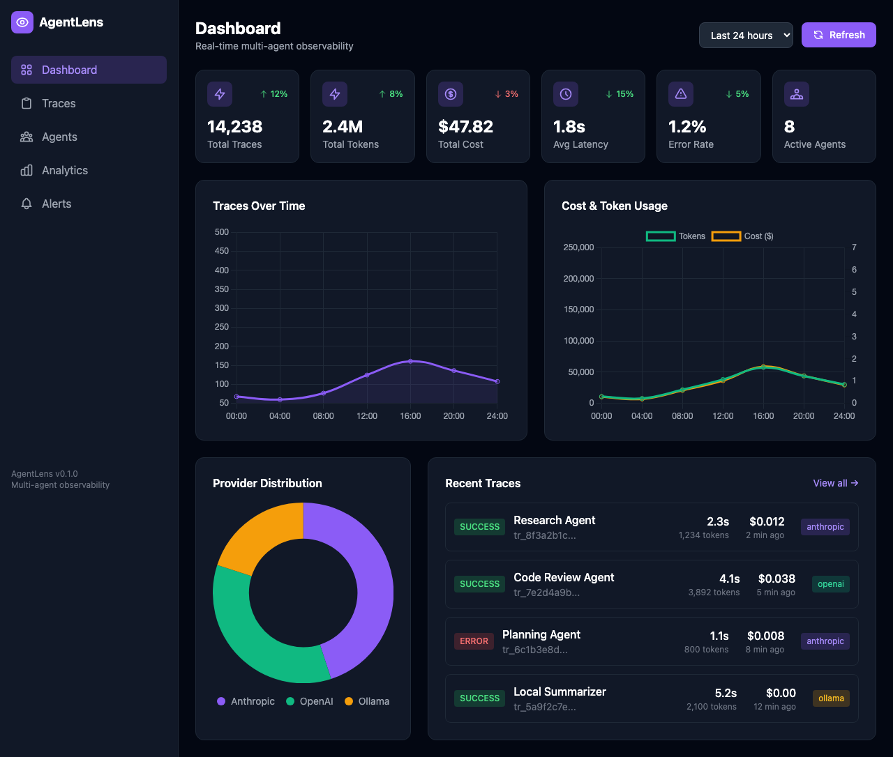

# 🔭 AgentLens

**Multi-Agent Observability Platform** — Full visibility into AI agent orchestration, handoffs, failures, and costs across Claude, GPT, Ollama, LangChain, and more.



---

## The Problem

You're building with AI agents. Claude orchestrates planning, GPT-4 handles code review, Ollama runs local summarization. Something breaks.

**Can you answer these questions?**
- Which agent failed?
- What was the input when it failed?
- How much did that trace cost?
- Why is latency spiking at 3 PM?
- Which model is most cost-effective for this task?

If you can't answer these **instantly**, you have an observability gap.

Traditional APM tools track HTTP requests. LLM-specific tools track single-model calls. Neither handles:
- Agent-to-agent handoffs
- Cost attribution across providers  
- Error propagation through chains
- In-session debugging from inside your coding agent

**AgentLens fills this gap.**

---

## Features

| Feature | Description |
|---------|-------------|
| 📊 **Real-time Tracing** | Track every agent call, handoff, and decision as it happens |
| 🔗 **Multi-Agent Support** | Visualize complex orchestration flows across multiple agents |
| 💰 **Cost Analytics** | Per-agent, per-model, per-trace cost tracking with trend analysis |
| ⚡ **Sub-50ms Overhead** | Async batching ensures minimal impact on your agents |
| 🔌 **Zero-Friction Integration** | Drop-in wrappers — no code changes to your existing logic |
| 🤖 **In-Session Querying** | Query traces from inside Claude Code, Codex, or any CLI agent |
| 📈 **Production-Ready** | ClickHouse storage, horizontal scaling, WebSocket streaming |

---

## Quick Start (5 Minutes)

### Step 1: Deploy the Collector

The collector receives and stores all trace data.

```bash
# Option A: Docker (recommended)
docker run -d -p 3100:3100 -p 3000:3000 phoenixaihub/agentlens

# Option B: From source
git clone https://github.com/phoenix-assistant/agentlens
cd agentlens
npm install && npm run build
npm run start
```

**Endpoints:**
- Dashboard: `http://localhost:3000`
- API: `http://localhost:3100`

### Step 2: Install the SDK

```bash
npm install @phoenixaihub/sdk
```

### Step 3: Wrap Your Existing Client (Zero Code Changes)

The magic: wrap your existing OpenAI/Anthropic client. All calls are traced automatically — your application logic stays exactly the same.

```typescript
import Anthropic from '@anthropic-ai/sdk';
import { AgentLensClient } from '@phoenixaihub/sdk';
import { wrapAnthropic } from '@phoenixaihub/integrations/anthropic';

// Initialize AgentLens (once)
const lens = new AgentLensClient({
  endpoint: 'http://localhost:3100',
});

// Wrap your existing client (one line)
const anthropic = new Anthropic();
const { client } = wrapAnthropic(anthropic, { client: lens });

// Use exactly as before — traces happen automatically
const response = await client.messages.create({
  model: 'claude-3-5-sonnet-20241022',
  max_tokens: 1024,
  messages: [{ role: 'user', content: 'Explain quantum computing' }],
});
```

**That's it.** Every call is now traced with:
- Token counts (input + output)
- Cost calculation
- Latency measurement
- Error capture with full context

---

## Integration Patterns

### Anthropic (Claude)

```typescript
import Anthropic from '@anthropic-ai/sdk';
import { wrapAnthropic } from '@phoenixaihub/integrations/anthropic';

const anthropic = new Anthropic();
const { client } = wrapAnthropic(anthropic, {
  client: lens,
  agentId: 'research-agent',        // Optional: identify this agent
  agentName: 'Research Agent',      // Optional: human-readable name
  capturePrompts: true,             // Optional: store prompts (careful with PII)
  captureCompletions: true,         // Optional: store completions
});

// All calls traced automatically
await client.messages.create({ ... });
```

### OpenAI (GPT-4, GPT-4o)

```typescript
import OpenAI from 'openai';
import { wrapOpenAI } from '@phoenixaihub/integrations/openai';

const openai = new OpenAI();
const { client } = wrapOpenAI(openai, { client: lens });

await client.chat.completions.create({
  model: 'gpt-4o',
  messages: [{ role: 'user', content: 'Hello!' }],
});
```

### LangChain

```typescript
import { ChatOpenAI } from '@langchain/openai';
import { AgentLensCallback } from '@phoenixaihub/integrations/langchain';

const callback = new AgentLensCallback({ client: lens });
const llm = new ChatOpenAI({
  callbacks: [callback],
});

await llm.invoke('What is the capital of France?');
```

### LangGraph

```typescript
import { wrapLangGraph } from '@phoenixaihub/integrations/langgraph';

// Wrap your entire graph
const instrumentedGraph = wrapLangGraph(myGraph, {
  client: lens,
  graphName: 'Research Pipeline',
});

// All nodes and edges are traced
await instrumentedGraph.invoke({ query: 'Analyze this document' });
```

### Vercel AI SDK

```typescript
import { createAgentLensMiddleware } from '@phoenixaihub/integrations/vercel-ai';

const middleware = createAgentLensMiddleware({ client: lens });
const instrumentedModel = middleware.wrapModel(openai('gpt-4o'));

const { text } = await generateText({
  model: instrumentedModel,
  prompt: 'Write a haiku about coding',
});
```

### Manual Instrumentation

For custom agents or frameworks without built-in support:

```typescript
const trace = lens.startTrace({
  session_id: 'user-session-123',
  user_id: 'user-456',
  metadata: { workflow: 'document-analysis' },
});

const span = trace.startSpan({
  agentId: 'custom-agent',
  agentName: 'Document Analyzer',
  provider: 'anthropic',
  modelVersion: 'claude-3-opus',
});

span.recordInput({ prompt_tokens: 1500, messages: [...] });

try {
  const result = await myCustomLogic();
  span.recordOutput({ 
    completion_tokens: 800, 
    status: 'success',
    completion: result 
  });
  span.end('success', Date.now() - startTime, 0.045);
} catch (error) {
  span.recordError({ message: error.message, stack: error.stack });
  span.end('error', Date.now() - startTime);
  throw error;
}

trace.end('success');
```

---

## In-Session Querying

The killer feature: **query your observability data from inside your AI coding session**. No context switching. Debug while you build.

### For Claude Code (MCP Server)

AgentLens provides an MCP server that gives Claude Code direct access to your traces.

**Setup:**
```bash
# Add to Claude Code
claude mcp add agentlens -- npx @phoenixaihub/mcp

# Or manually in ~/.config/claude/claude_desktop_config.json
{
  "mcpServers": {
    "agentlens": {
      "command": "npx",
      "args": ["@phoenixaihub/mcp"],
      "env": {
        "AGENTLENS_URL": "http://localhost:3100"
      }
    }
  }
}
```

**Available Tools:**

| Tool | Description |
|------|-------------|
| `agentlens_stats` | Summary stats (traces, tokens, cost, latency, errors) |
| `agentlens_agents` | Per-agent breakdown with metrics |
| `agentlens_models` | Per-model breakdown (gpt-4o vs claude-3-5-sonnet) |
| `agentlens_traces` | List recent traces with status and cost |
| `agentlens_trace` | Deep dive into a specific trace with events timeline |
| `agentlens_errors` | List recent errors with context |

**Example in Claude Code:**
```
You: What's my agent performance looking like?

Claude: Let me check... [uses agentlens_stats]

## AgentLens Stats (1h)

| Metric | Value |
|--------|-------|
| Total Traces | 234 |
| Total Tokens | 1.2M |
| Total Cost | $3.42 |
| Avg Latency | 2.1s |
| Error Rate | 1.2% |
| Active Agents | 4 |
```

### For Any CLI Agent (Codex, Copilot, Cursor, etc.)

Agents that can run shell commands get quick inline commands:

```bash
# Install CLI globally
npm install -g @phoenixaihub/cli

# Quick stats (designed for inline agent use)
agentlens q stats
# → Traces: 234 | Tokens: 1.2M | Cost: $3.42 | Latency: 2.1s | Errors: 1.2%

agentlens q agents
# → Per-agent table

agentlens q errors
# → Recent errors with context

agentlens q cost
# → Just the cost: $3.42 (1h) | $47.82 (24h)
```

These commands are optimized for:
- **Minimal output** — fits in agent context
- **Fast execution** — sub-100ms
- **Parseable** — easy for agents to process

---

## CLI Reference

### Installation

```bash
# From npm
npm install -g @phoenixaihub/cli

# Verify
agentlens --version
```

### Initialize Configuration

```bash
agentlens init --url http://localhost:3100
# Creates ~/.agentlens/config.json
```

### Live Tail (Real-time Streaming)

```bash
# Stream all traces
agentlens tail

# Compact mode (one line per trace)
agentlens tail --compact

# Only errors
agentlens tail --errors

# Filter by agent
agentlens tail --agent research-agent

# Verbose (show inputs/outputs)
agentlens tail --verbose
```

**Example output:**
```
14:32:01 [SUCCESS] anthropic research-agent  2.3s 1.2K tok $0.012
14:32:15 [ERROR  ] openai   planning-agent   1.1s  800 tok ✗ Rate limit
14:32:22 [SUCCESS] ollama   local-summarizer 5.2s 2.4K tok $0.000
14:32:45 [SUCCESS] anthropic code-review     4.1s 3.9K tok $0.038
```

### List Traces

```bash
# Recent traces
agentlens list

# More traces
agentlens list -n 50

# Filter by agent
agentlens list --agent code-review

# Only errors
agentlens list --errors

# JSON output (for scripting)
agentlens list --json
```

### View Trace Details

```bash
# Summary
agentlens view tr_8f3a2b1c

# With full event timeline
agentlens view tr_8f3a2b1c --events

# JSON output
agentlens view tr_8f3a2b1c --json
```

### Statistics

```bash
# Summary (default: last hour)
agentlens stats

# Time ranges
agentlens stats --24h
agentlens stats --7d
agentlens stats --hours 6

# Breakdowns
agentlens stats agents     # Per-agent
agentlens stats models     # Per-model
agentlens stats providers  # Per-provider

# Filter by agent
agentlens stats --agent research-agent --24h
```

**Example output:**
```
$ agentlens stats agents --24h

  🤖 Agents (24h)
  ──────────────────────────────────────────────────────────────────────

  AGENT                     TRACES    TOKENS      COST    AVG LAT   ERR%
  ──────────────────────────────────────────────────────────────────────
  research-agent               234      1.2M     $3.42      2.1s   1.2%
  code-review-agent            156      890K     $1.87      1.4s   0.5%
  planning-agent                89      450K     $0.92      3.2s   2.8%
  local-summarizer              67      234K     $0.00      5.1s   0.0%
  ──────────────────────────────────────────────────────────────────────
  TOTAL                        546      2.8M     $6.21      2.5s   1.1%
```

### Wrap External CLI Tools

Trace any CLI command that uses AI:

```bash
# Claude CLI
agentlens wrap "claude 'explain this code'"

# GitHub Copilot
agentlens wrap "gh copilot suggest 'write unit tests'"

# Ollama
agentlens wrap "ollama run llama3 'summarize this'"

# Any command with custom agent name
agentlens wrap --name my-agent "python my_agent.py"
```

---

## Dashboard

The web dashboard provides visual exploration of your traces.


### Views

| View | Description |
|------|-------------|
| **Dashboard** | Overview with stats cards, charts, recent traces |
| **Traces** | Searchable trace list with filters |
| **Trace Detail** | Timeline view of a single trace with all events |
| **Agents** | Per-agent metrics and health |
| **Analytics** | Cost trends, latency distributions, error analysis |
| **Alerts** | Configure alerting thresholds |

### Trace Detail View

Click any trace to see:
- Full event timeline
- Agent handoff visualization
- Token breakdown (input vs output)
- Cost attribution per step
- Error context with stack traces
- Input/output inspection (if captured)

---

## Architecture

```
┌─────────────────────────────────────────────────────────────────────────┐
│                           Your Application                               │
│  ┌──────────────┐  ┌──────────────┐  ┌──────────────┐  ┌─────────────┐ │
│  │    Claude    │  │    GPT-4     │  │    Ollama    │  │  LangChain  │ │
│  └──────┬───────┘  └──────┬───────┘  └──────┬───────┘  └──────┬──────┘ │
│         │                 │                 │                 │         │
│         └─────────────────┴─────────────────┴─────────────────┘         │
│                                   │                                     │
│                    ┌──────────────▼──────────────┐                      │
│                    │   @phoenixaihub/sdk         │                      │
│                    │   (Wrapper / Instrumentation)│                     │
│                    └──────────────┬──────────────┘                      │
└───────────────────────────────────┼─────────────────────────────────────┘
                                    │ 
                                    │ Async HTTP (batched)
                                    ▼
┌─────────────────────────────────────────────────────────────────────────┐
│                        AgentLens Collector                              │
│  ┌──────────────┐  ┌──────────────┐  ┌──────────────┐                  │
│  │  REST API    │  │  WebSocket   │  │  Alerting    │                  │
│  │  /v1/*       │  │  /v1/ws      │  │  Engine      │                  │
│  └──────┬───────┘  └──────┬───────┘  └──────┬───────┘                  │
│         └─────────────────┴─────────────────┘                          │
│                           │                                             │
│              ┌────────────▼────────────┐                               │
│              │      ClickHouse         │                               │
│              │  (events, traces,       │                               │
│              │   materialized views)   │                               │
│              └─────────────────────────┘                               │
└─────────────────────────────────────────────────────────────────────────┘
                                    │
           ┌────────────────────────┼────────────────────────┐
           ▼                        ▼                        ▼
┌───────────────────┐    ┌───────────────────┐    ┌───────────────────┐
│    Dashboard      │    │    MCP Server     │    │    CLI Tool       │
│  (React + Vite)   │    │  (Claude Code)    │    │  (agentlens)      │
│  localhost:3000   │    │  npx @.../mcp     │    │  npm i -g @.../cli│
└───────────────────┘    └───────────────────┘    └───────────────────┘
```

### Data Flow

1. **Instrumentation**: SDK wraps your AI client calls
2. **Batching**: Events batched locally (100 events or 1s, whichever first)
3. **Ingestion**: Batch sent to collector via HTTP POST
4. **Storage**: Events written to ClickHouse with automatic partitioning
5. **Materialized Views**: Pre-aggregated stats for fast queries
6. **Querying**: Dashboard/CLI/MCP query the collector API
7. **Real-time**: WebSocket streams events as they arrive

---

## Configuration

### Environment Variables (Collector)

| Variable | Description | Default |
|----------|-------------|---------|
| `PORT` | HTTP port | `3100` |
| `DASHBOARD_PORT` | Dashboard port | `3000` |
| `API_KEYS` | Comma-separated API keys (optional) | |
| `STORE_TYPE` | `memory` or `clickhouse` | `memory` |
| `CLICKHOUSE_URL` | ClickHouse HTTP endpoint | `http://localhost:8123` |
| `CLICKHOUSE_DATABASE` | Database name | `agentlens` |
| `LOG_LEVEL` | `debug`, `info`, `warn`, `error` | `info` |

### SDK Configuration

```typescript
const lens = new AgentLensClient({
  // Required
  endpoint: 'http://localhost:3100',
  
  // Optional: Authentication
  apiKey: 'your-api-key',
  
  // Optional: Batching
  batchSize: 100,           // Events per batch (default: 100)
  flushInterval: 1000,      // Flush interval ms (default: 1000)
  
  // Optional: Reliability
  timeout: 5000,            // Request timeout ms (default: 5000)
  retries: 3,               // Retry attempts (default: 3)
  
  // Optional: Context
  environment: 'production', // Environment tag
  release: 'v1.2.3',        // Release version tag
  
  // Optional: Sampling
  sampleRate: 1.0,          // 1.0 = 100% of traces (default: 1.0)
});
```

### CLI Configuration

```bash
# Initialize with custom URL
agentlens init --url http://your-collector:3100

# Config stored at ~/.agentlens/config.json
{
  "collectorUrl": "http://localhost:3100",
  "apiKey": "optional-key"
}
```

---

## Production Deployment

### Docker Compose (Recommended)

```yaml
version: '3.8'
services:
  agentlens:
    image: phoenixaihub/agentlens
    ports:
      - "3100:3100"  # API
      - "3000:3000"  # Dashboard
    environment:
      - STORE_TYPE=clickhouse
      - CLICKHOUSE_URL=http://clickhouse:8123
    depends_on:
      - clickhouse

  clickhouse:
    image: clickhouse/clickhouse-server:24.3
    volumes:
      - clickhouse_data:/var/lib/clickhouse
    ulimits:
      nofile:
        soft: 262144
        hard: 262144

volumes:
  clickhouse_data:
```

### Kubernetes

Helm chart coming soon. For now, use the Docker image with your preferred K8s deployment method.

### Scaling

- **Collector**: Stateless, horizontally scalable behind load balancer
- **ClickHouse**: Use ClickHouse Cloud or self-managed cluster for high volume
- **Dashboard**: Static assets, can be served from CDN

---

## API Reference

### REST Endpoints

| Method | Endpoint | Description |
|--------|----------|-------------|
| `POST` | `/v1/events` | Ingest single event |
| `POST` | `/v1/events/batch` | Ingest event batch |
| `GET` | `/v1/traces` | List traces (paginated) |
| `GET` | `/v1/traces/:id` | Get trace with events |
| `GET` | `/v1/agents` | List agents with stats |
| `GET` | `/v1/stats/summary` | Dashboard summary |
| `GET` | `/health` | Health check |

### WebSocket

```javascript
const ws = new WebSocket('ws://localhost:3100/v1/ws');

// Subscribe to all events
ws.send(JSON.stringify({ type: 'subscribe_all' }));

// Subscribe to specific trace
ws.send(JSON.stringify({ type: 'subscribe', trace_id: 'tr_abc123' }));

// Filter by agent
ws.send(JSON.stringify({ type: 'subscribe', agent_id: 'research-agent' }));

// Receive events
ws.onmessage = (event) => {
  const { type, data } = JSON.parse(event.data);
  console.log('Event:', data);
};
```

---

## Packages

| Package | npm | Description |
|---------|-----|-------------|
| `@phoenixaihub/sdk` | [](https://npmjs.com/package/@phoenixaihub/sdk) | Client SDK |
| `@phoenixaihub/integrations` | [](https://npmjs.com/package/@phoenixaihub/integrations) | Framework integrations |
| `@phoenixaihub/cli` | [](https://npmjs.com/package/@phoenixaihub/cli) | CLI tool |
| `@phoenixaihub/mcp` | [](https://npmjs.com/package/@phoenixaihub/mcp) | MCP server |
| `@phoenixaihub/collector` | [](https://npmjs.com/package/@phoenixaihub/collector) | Collector service |

---

## Comparison

| Feature | AgentLens | LangSmith | Arize | Helicone |
|---------|-----------|-----------|-------|----------|
| Multi-agent handoff tracking | ✅ | ⚠️ Limited | ❌ | ❌ |
| In-session querying (MCP/CLI) | ✅ | ❌ | ❌ | ❌ |
| Self-hosted | ✅ | ❌ | ❌ | ⚠️ Enterprise |
| Real-time WebSocket | ✅ | ❌ | ❌ | ❌ |
| Cost tracking | ✅ | ✅ | ✅ | ✅ |
| Open source | ✅ | ❌ | ❌ | ✅ |

---

## Roadmap

- [x] Core SDK with batching and retries
- [x] ClickHouse storage with materialized views
- [x] React dashboard with real-time updates
- [x] OpenAI/Anthropic integrations
- [x] LangChain/LangGraph integrations
- [x] Vercel AI SDK integration
- [x] CLI tool with live tail
- [x] MCP server for Claude Code
- [x] Docker deployment
- [ ] Kubernetes Helm chart
- [ ] Slack/Discord/PagerDuty alerting
- [ ] Cost anomaly detection
- [ ] Session replay with timeline scrubbing
- [ ] A/B testing for prompts
- [ ] Prompt registry and versioning

---

## Contributing

We welcome contributions! See [CONTRIBUTING.md](./CONTRIBUTING.md) for guidelines.

```bash
# Clone
git clone https://github.com/phoenix-assistant/agentlens
cd agentlens

# Install
npm install

# Development (all packages)
npm run dev

# Build
npm run build

# Test
npm test

# Lint
npm run lint
```

---

## Community

- 💬 [Discord](https://discord.gg/phoenix-assistant)
- 🐦 [Twitter](https://twitter.com/phoenixaihub)
- 📝 [Blog](https://medium.com/@phoenixaihub)

---

## License

MIT — see [LICENSE](./LICENSE).

---

**Built with ❤️ for the AI agent community.**

*Stop flying blind. Start seeing everything.*
